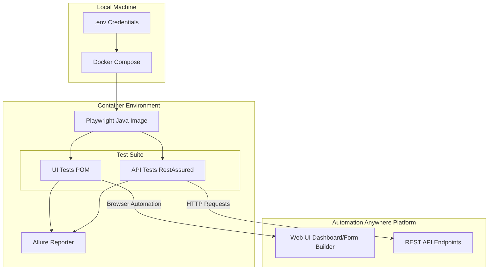

# Automation Anywhere Test Framework

A robust, containerized testing framework designed to validate both UI and API interactions within the Automation Anywhere Community Edition platform.

## Table of Contents
1. [Architecture & Data Flow](#architecture--data-flow)
2. [Design & Tool Choices](#design--tool-choices)
3. [Prerequisites](#prerequisites)
4. [Setup Instructions](#setup-instructions)
5. [Execution Guide](#execution-guide)
6. [Test Reporting](#test-reporting)

---

## Architecture & Data Flow

The framework is designed to run seamlessly inside a Docker container, executing tests against the live Automation Anywhere web application.



---

## Design & Tool Choices

### Tool Stack
- **Java 17 & Maven**: The industry standard for robust enterprise test automation. Maven handles our dependency management.
- **Playwright (Java Port)**: Chosen over Selenium for UI automation due to its superior speed, auto-waiting mechanism, and native support for modern web elements (like shadow DOM and complex drag-and-drop operations).
- **RestAssured**: Provides a highly readable, behavior-driven (Given/When/Then) syntax for API testing and assertions.
- **Allure**: Used for generating comprehensive, visual HTML test reports that include execution time and step breakdowns.
- **Docker Compose**: Eliminates the "it works on my machine" problem by standardizing the test execution environment.

### Standard Issues Encountered & Resolutions

1. **Iframe Context Switching (UI Automation)**
   - **Issue**: The Automation Anywhere form builder is hosted inside a dynamic `iframe`. Standard Playwright `page.locator()` or `page.getByRole()` calls were timing out because they only query the main DOM by default.
   - **Resolution**: Utilized Playwright's `page.frameLocator("iframe").first()` to explicitly route all element searches (like adding textboxes and clicking save) into the iframe context.

2. **Hidden/Disabled State Timeouts (UI Automation)**
   - **Issue**: The "Save" button inside the form builder was logically disabled in the DOM (e.g., `command-button__button--is_disabled`) until an element was successfully added to the canvas. Playwright's `.click()` action inherently waits for an element to be actionable, which caused 60-second timeouts.
   - **Resolution**: Ensured the textboxes were successfully dragged and dropped onto the canvas (`.dragTo()`) first, which unlocked the UI state and enabled the Save button, rather than attempting to force-click it.

3. **Complex Payload Strictness (API Flow)**
   - **Issue**: The backend API for creating Learning Instances rejected requests if the exact provider IDs, domain language GUIDs, and hidden metadata flags weren't fully provided in the JSON body, throwing generic "provider not found" errors.
   - **Resolution**: Intercepted the exact HTTP POST payload generated by the browser's UI using the network tab, saved it as a raw JSON payload, and dynamically injected the test identifiers into it before POSTing to the API.

---

## Prerequisites

- **Docker** and **Docker Compose** installed on your system.
- Registered credentials for the Automation Anywhere Community Edition.

---

## Setup Instructions

1. **Clone the repository:**
   ```bash
   git clone <repo_url>
   cd automation-assignment
   ```

2. **Configure Credentials:**
   To securely pass your login details to the test suite, duplicate the example environment file and fill it in.
   ```bash
   cp .env.example .env
   ```
   Open the new `.env` file in your editor and provide your username and password.

3. **Locator Adjustments:**
   Web applications frequently update their DOM elements. If a test fails to find an element, inspect the page and update the respective selector inside `src/main/java/com/automationanywhere/pages/`.

---

## Execution Guide

### Using Docker (Recommended)
This is the most reliable way to run the suite. It uses the official Microsoft Playwright image and runs entirely headlessly (no browser pops up). It also caches Maven dependencies to drastically speed up consecutive runs.

```bash
docker-compose up
```
*Once the container exits, test results are automatically mapped back to your local `target/` directory.*

### Running Locally (Headed Mode)
If you want to debug the tests and watch the browser magically click buttons on your screen:
1. Ensure Java 17 and Maven are installed locally.
2. Open `src/test/java/com/automationanywhere/ui/FormRulesBuilderTest.java`.
3. Change `PlaywrightFactory.initBrowser("chromium", true)` to `false` (turns off headless mode).
4. Run the suite:
   ```bash
   mvn clean test
   ```

---

## Test Reporting

The framework generates rich Allure test reports. After execution (either via Docker or locally), you can serve the report to view the results in your browser:

```bash
mvn allure:serve
```
*Note: This command spins up a temporary local web server and opens the HTML report dashboard.*
